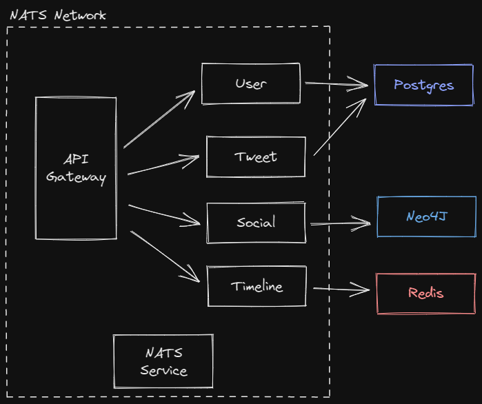

# MicroTwitt

A simple twitter like application for learning [NestJS Microservice](https://docs.nestjs.com/microservices/basics#installation)

## Tech Stack

## Architecture

Application has basic functionality of an web application backend for user authentication, Tweet CRUD operations, timeline creation, search and social networking.

Functionalities are separated as a microservice. In microservice architecture, generally each service has own team to manage & develop its features.

Each microservice:

- is containerized with Docker
- has own scope, development lifecycle
- has own package management

## Services

### Api Gateway

API gateway is single entry point for all services. External clients access data & functions via REST API. Api Gateway delegates the request to other services

### User

Responsible for User management. Using JWT Authentication

### Social

Serves and updates user relations (follow mechanism) and provides searching in graph data. Uses neo4j graph database.
We can manage this service for creating follow suggestions and improving search of users

### Timeline

Creates and serves timeline data for each user and caches to be able to respond fast. This service can be modified for injecting ads and suggestions for income and better user experience

### Tweet

CRUD and search operations of Tweets are handled in Tweet microservice. It uses Postgres database which is also used by User microservice, to reduce data layer services. But if we would like to separate concerns of development and create a domain driven architecture, we can create another database for this service

## How to Run

Use docker compose to build and run.
> docker compose build  
> docker compose up

You can use swagger page to access and send request to API.
enter address to yor browser
>http://localhost:3000

## Conclusion

I've omitted the unit tests, integration tests, data seed, monitoring tools, detailed logs, SSL
(maybe I will add data seed and monitoring tool later)

Creating and developing all micro services in one repo has overheads:

- Services have shared packages but we must handle them isolated, that's why each image build common packages over again
- Difficult to create reusable components
- Increasing internal network traffic
- Challenging to match logs of each services' logs to review of an user session

## TODO

- Add a monitoring tool: e.g [zipkin](https://zipkin.io/)
- Add data seeding script
- Test with 2x of each service to inspect routing/load balancing of NATS